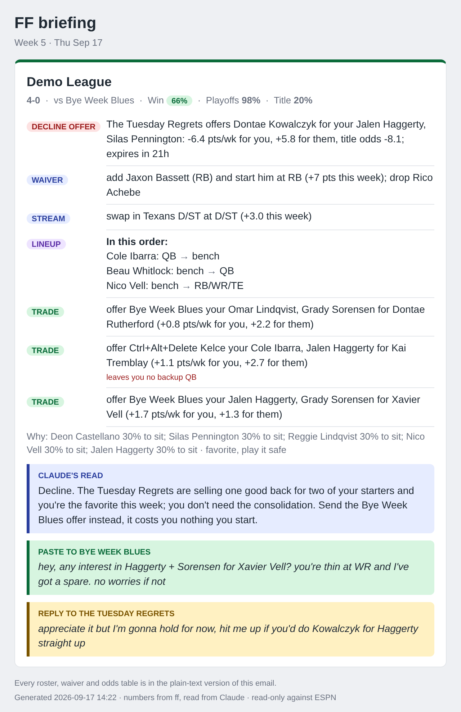
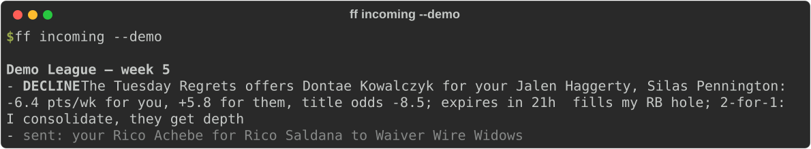
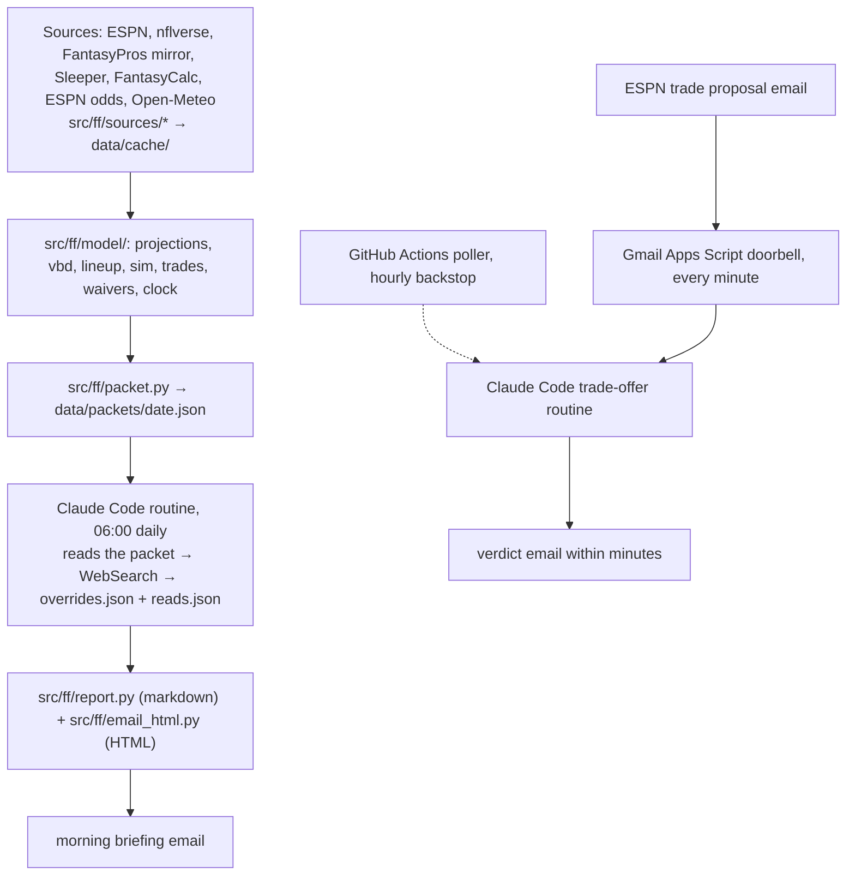

# ff — a fantasy football co-manager

[](https://github.com/dustinJ15/fantasy/actions/workflows/ci.yml)
[](LICENSE)


*Deterministic analytics for ESPN leagues. Claude reads the news. I tap the buttons.*

I joined three fantasy football leagues this year knowing roughly nothing, so naturally I built a quant desk.
Every morning a script pulls my ESPN leagues, runs the math, and an LLM reads the injury reports and writes me an email
that says what to do. Everything is read-only against ESPN; I make the moves myself. I may or may not be cheating.

[Try it](#try-it) · [The one rule](#the-one-rule) · [What the math does](#what-the-math-does) · [Architecture](#architecture) · [Commands](#commands)

<p align="center">
  <br>
  <sub>The morning email, from the demo league. Every name is made up; every number comes from <code>ff</code>.</sub>
</p>

<p align="center">
  <br>
  <sub>The same offer from the terminal. Someone in a league of eight always wants your two starters for their one.</sub>
</p>

## The one rule

**Code owns state and math. Claude owns judgment over unstructured text.**

The deterministic side (`ff`, a Python CLI) pulls the data, blends projections, models injury risk, optimizes the
lineup, simulates the season, scans trades and prices waiver bids, then writes everything to a versioned JSON
"decision packet". The LLM side (a Claude Code routine) reads that packet, web-searches the players whose status is
ambiguous, and hands back two small JSON files:

```jsonc
// overrides.json: parameters, not decisions. Only for players where the news changed the picture.
{"100": {"p_zero": 0.5,  "note": "Q, DNP Friday; beat writer says game-time decision"},
 "108": {"mu_mult": 1.15, "note": "named the starter after the trade; expect a full workload"}}

// reads.json: one or two plain sentences per league, plus a message I can paste to a rival.
{"demo": {"read": "Decline. They're selling one good back for two of your starters and you're the favorite this week.",
          "reply": "appreciate it but I'm gonna hold for now", "reply_to": "The Tuesday Regrets"}}
```

`ff` re-runs with the overrides and renders the email. Every number in the briefing comes from code; Claude never
emits a figure, never edits the HTML, and never writes to ESPN. The full playbook the routine follows is
[.claude/skills/briefing/SKILL.md](.claude/skills/briefing/SKILL.md).

## What the math does

- **Projections**: equal-weight blend of ESPN and Sleeper stat projections, FantasyPros rank as a fallback, Vegas implied
  team total as a small multiplier. Every source is logged daily so `ff accuracy` can say which one is actually good.
- **Injury-aware distributions**: each player is a mixture of "plays" and "zero", with `p_zero` from the practice-report
  designation and overridable by the morning research.
- **Win-probability lineups**: the optimizer maximizes P(beat this week's opponent), not expected points. Favorites get
  floor, underdogs get ceiling, without anyone deciding to.
- **Monte Carlo season sim**: playoff and title odds for every team, and the common yardstick for every decision below.
- **Trade scanner**: every 1-for-1 and 2-for-1 against every rival, scored by both sides' lineup delta and re-simulated
  title odds. Incoming offers get an accept / decline / counter verdict the same way, plus a FantasyCalc market check.
  It also refuses to trade away your last healthy quarterback, which is more than I can say for myself.
- **Waivers**: value over your own starter, FAAB bids sized to the upgrade, streamers for K and D/ST.
- **Game clock**: once a player has kicked off he is locked and his actual points are banked, so the Monday email
  never suggests benching someone who already played.

## Architecture



Operations, briefly: a scheduled Claude Code routine runs the playbook every morning and pings a healthchecks.io
dead-man's switch when it succeeds. When a rival sends an offer, a one-minute Apps Script in Gmail spots ESPN's
notification and fires a second routine that emails a verdict and a reply I can paste; an hourly GitHub Actions
poller is the backstop if the doorbell misses. There is no code path that writes to ESPN, by construction.

## Try it

No ESPN account needed for the demo. It builds a synthetic 8-team league of fictional players (with a pending trade
offer) and runs the whole pipeline on it:

```
uv sync
uv run ff briefing --demo            # markdown briefing on stdout
uv run ff incoming --demo            # the incoming-offer verdict
uv run ff packet --demo              # the raw decision packet JSON
```

The output of exactly that, plus the rendered email, is in [examples/](examples/); `scripts/screenshots.sh` regenerates
all of it, images included.

For your own leagues:

```
cp .env.example .env                 # ESPN cookies, see scripts/setup_cookies.md
cp leagues.example.toml leagues.toml # league ids and your team id
uv run ff setup-check                # prints every team and marks yours
uv run ff sync && uv run ff briefing
```

## Commands

| command | what |
|---|---|
| `ff setup-check` | verify cookies and league ids, print teams |
| `ff doctor` | data freshness per source, cookie health |
| `ff sync [--force]` | refresh every source into `data/cache/` |
| `ff roster` | my roster with blended projections and flags |
| `ff lineup` | P(win)-optimal lineup vs this week's opponent, and how it differs from the max-points lineup |
| `ff waivers` | ranked free agents, FAAB bids, streamers |
| `ff trades` | rival roster scan, candidate packages, both-side title-odds delta |
| `ff incoming [--json --new-since 40m]` | offers other managers sent me, with a verdict |
| `ff odds` | Monte Carlo playoff and title odds for every team |
| `ff packet` | write the versioned decision packet JSON |
| `ff briefing [--overrides f] [--reads f]` | render the full markdown briefing |
| `ff render-email --packet p --reads f` | render the HTML email from an existing packet |
| `ff log-projections` / `ff accuracy` | log every source daily; MAE and bias by source and position |

All commands take `--league <name>`; `briefing`, `packet` and `incoming` take `--demo`.

## How it's built

Python 3.12+, [uv](https://docs.astral.sh/uv/), typer, pydantic, numpy/scipy for the sims, polars for the nflverse
tables. `uv run pytest` runs 40 tests over the synthetic league, so the whole pipeline is exercised with no network
and no credentials; CI runs the tests, ruff, and the demo briefing on every push. The email is hand-rolled table HTML
because email clients are where CSS goes to die.

## Honest limits

The projections are borrowed, so the edge is in how they are used, not in the numbers. Variance is a prior, not
fitted. Usage signals are thin until week 4. [ROADMAP.md](ROADMAP.md) has the full list and what would actually
move the needle. [CLAUDE.md](CLAUDE.md) is the operator's manual the agent reads; it is more useful than this file if
you want to run it.

Data sources are all free and keyless: espn-api, nflreadpy, the dynastyprocess FantasyPros mirror, Sleeper,
FantasyCalc, the ESPN scoreboard, Open-Meteo. Nothing is scraped.

MIT licensed. Current record across three leagues: withheld, for the same reason the model calls variance "a prior".
