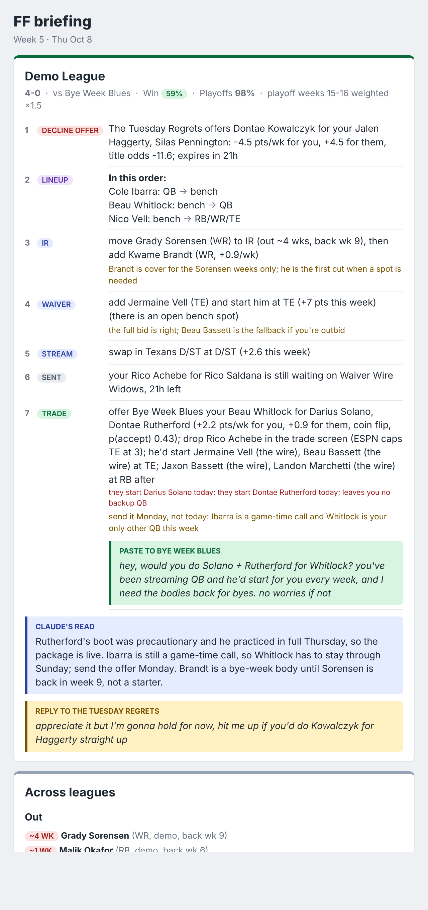
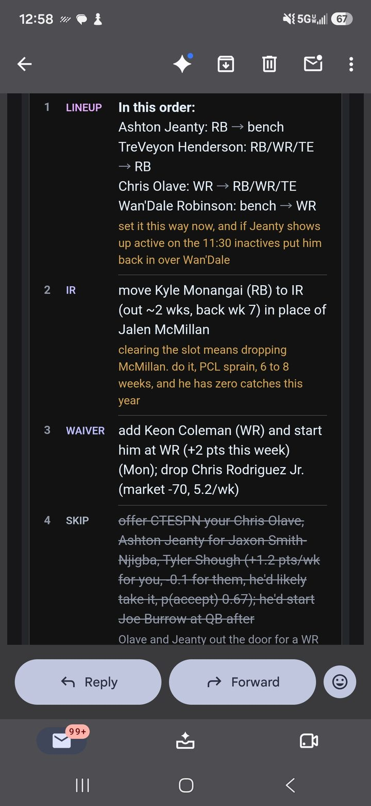
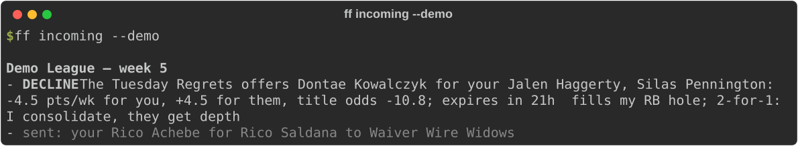
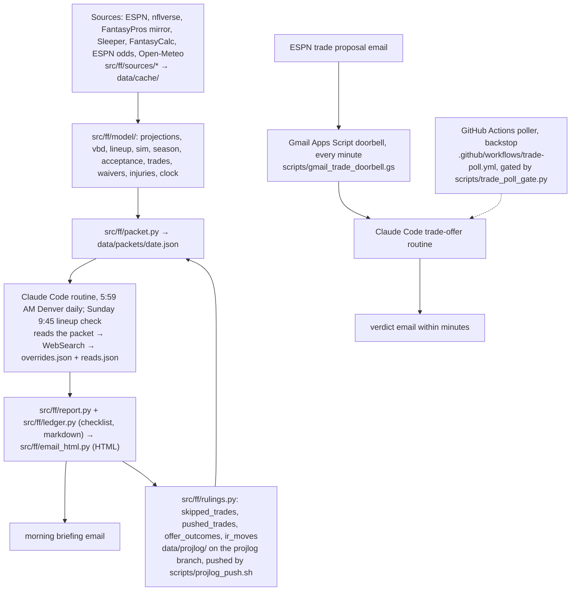

# ff — a fantasy football co-manager

[](https://github.com/dustinJ15/fantasy/actions/workflows/ci.yml)
[](LICENSE)


*Deterministic analytics for ESPN leagues. Claude reads the news. I tap the buttons.*

I joined three fantasy football leagues this year knowing roughly nothing, so naturally I built a quant desk.
Every morning a script pulls my ESPN leagues, runs the math, and an LLM reads the injury reports and writes me an email
that says what to do. Everything is read-only against ESPN; I make the moves myself. I may or may not be cheating.

[Try it](#try-it) · [The one rule](#the-one-rule) · [What the math does](#what-the-math-does) · [Architecture](#architecture) · [Commands](#commands)

<table align="center">
  <tr>
    <td align="center" valign="top" width="640">
      <br>
      <sub>The morning email, from the demo league. Every name is made up; every number comes from <code>ff</code>.</sub>
    </td>
    <td align="center" valign="top" width="300">
      <br>
      <sub>The real one, on the phone, one Saturday in October. Row 2 is the bug fixed that afternoon: McMillan was locked in the IR slot.</sub>
    </td>
  </tr>
</table>

<p align="center">
  <br>
  <sub>The same offer from the terminal. Someone in a league of eight always wants your two starters for their one.</sub>
</p>

## The one rule

**Code owns state and math. Claude owns judgment over unstructured text.**

The deterministic side (`ff`, a Python CLI) pulls the data, blends projections, models injury risk, optimizes the
lineup, simulates the season, scans trades and prices waiver bids, then writes everything to a versioned JSON
"decision packet". The LLM side (a Claude Code routine) reads that packet, web-searches the players whose status is
ambiguous, and hands back two small JSON files:

```jsonc
// overrides.json: parameters, not decisions. Only for players where the news changed the picture.
{"100": {"p_zero": 0.5,  "note": "Q, DNP Friday; beat writer says game-time decision"},
 "108": {"mu_mult": 1.15, "note": "named the starter after the trade; expect a full workload"},
 "115": {"weeks_out": 6, "note": "high ankle sprain, team says 4-6 weeks; the card decides IR / hold / drop / trade"}}

// reads.json: one or two plain sentences per league, plus a message I can paste to a rival.
{"demo": {"read": "Decline. They're selling one good back for two of your starters and you're the favorite this week.",
          "reply": "appreciate it but I'm gonna hold for now", "reply_to": "The Tuesday Regrets"}}
```

`ff` re-runs with the overrides and renders the email. Every number in the briefing comes from code; Claude never
emits a figure, never edits the HTML, and never writes to ESPN. The full playbook the routine follows is
[.claude/skills/briefing/SKILL.md](.claude/skills/briefing/SKILL.md).

## What the math does

- **Projections**: equal-weight blend of ESPN and Sleeper stat projections, FantasyPros rank as a fallback, Vegas implied
  team total as a small multiplier. Wind at kickoff over 15 mph (Open-Meteo) discounts QB, WR, TE and K for this week
  only, flat past 25 mph; rest-of-season numbers never see it. Rest-of-season per game is season-to-date points per game
  with the preseason total as a prior that fades out by game six. Every source is logged daily to `data/projlog/` (the
  `projlog` branch) so `ff accuracy` can score each pre-kickoff forecast against ESPN's actual and say which one is good.
- **Injury-aware distributions**: each player is a mixture of "plays" and "zero", with `p_zero` from the practice-report
  designation (day-aware for Questionable: 15% early in the week, 30% from Friday) and overridable by the morning
  research. A hurt player gets a hold / IR / drop / trade verdict from `weeks_out`, with the IR slot's history remembered
  so a bouncing tag does not churn the bench.
- **Win-probability lineups**: the optimizer maximizes P(beat this week's opponent), not expected points. Favorites get
  floor, underdogs get ceiling, without anyone deciding to. A deviation from the highest-points lineup has to buy at least
  1.5 pp of P(win) (`MIN_WIN_GAIN` in `src/ff/model/lineup.py`); the row prints the gain. From Saturday on the opponent is
  priced on his set lineup, not the optimizer's guess of his best one.
- **Monte Carlo season sim**: playoff and title odds for every team, and the common yardstick for every decision below.
  Playoff weeks are weighted by my playoff odds (`week_weight` in `src/ff/model/season.py`), so a dead team prices a
  week-16 return at nothing. Title-odds deltas on trade and offer rows re-sim with common random numbers, so a null
  trade reads 0.0 instead of seed noise.
- **Trade scanner**: every 1-for-1 and 2-for-1 against every rival, both rosters priced week by week with the wire as
  the fallback body, ranked by p(accept) × my gain (`src/ff/model/acceptance.py`: consolidation tax, star premium, a
  QB asked only from a roster with two, throw-ins refused). Incoming offers get an accept / decline / counter verdict
  the same way, plus a FantasyCalc market check. Skips, pushes and what rivals did with my offers are remembered
  (`src/ff/rulings.py`), so a package I passed on stays gone for two weeks and a rival who just declined costs the next
  package a factor. It also refuses to trade away your last healthy quarterback, which is more than I can say for myself.
- **Waivers**: value over your own starter. All three leagues run waiver priority, so a row says `claim` (still on
  waivers, with my priority and, in a rolling order, whether the claims that priority would win later are worth more
  than this one) or `add` (free agent, mine the moment I click); FAAB bids are still sized where a league uses them.
  Streamers for K and D/ST, handcuffs for my RB starters.
- **Checklist ledger**: every add spends a roster spot exactly once (`src/ff/ledger.py`: open bench spot first, then the
  cheapest drop not already named), so an activation and a pickup never cut the same body. The drop order is
  `drop_cost`: rest-of-season points plus a market penalty for cutting someone a rival would trade for, plus a
  handcuff's insurance value, less the week a body on bye gives the pickup nothing for. Bodies are counted against
  ESPN's per-position caps, so a trade row names the drop the trade screen will demand. The checklist runs in the order
  the app allows: IR moves and pickups first, then the lineup once the roster is what it will be, with a pickup who
  starts this week folded into the lineup row as a move conditional on the add.
- **Game clock**: once a player has kicked off he is locked and his actual points are banked, so the Monday email
  never suggests benching someone who already played. A locked player is also never today's drop or IR move, since
  ESPN refuses both until the week rolls on Tuesday; the row says so and names the day.

## Architecture


```mermaid
flowchart TB
  sources["Sources: ESPN, nflverse, FantasyPros mirror, Sleeper, FantasyCalc, ESPN odds, Open-Meteo<br/>src/ff/sources/* → data/cache/"]
  sources --> model["src/ff/model/: projections, vbd, lineup, sim, season, acceptance, trades, waivers, injuries, clock"]
  model --> packet["src/ff/packet.py → data/packets/date.json"]
  memory["src/ff/rulings.py: skipped_trades, pushed_trades, offer_outcomes, ir_moves<br/>data/projlog/ on the projlog branch, pushed by scripts/projlog_push.sh"] --> packet
  packet --> claude["Claude Code routine, 5:59 AM Denver daily; Sunday 9:45 lineup check<br/>reads the packet → WebSearch → overrides.json + reads.json"]
  claude --> render["src/ff/report.py + src/ff/ledger.py (checklist, markdown) → src/ff/email_html.py (HTML)"]
  render --> gmail["morning briefing email"]
  render --> memory

  tp["ESPN trade proposal email"] --> bell["Gmail Apps Script doorbell, every minute<br/>scripts/gmail_trade_doorbell.gs"]
  poll["GitHub Actions poller, backstop<br/>.github/workflows/trade-poll.yml, gated by scripts/trade_poll_gate.py"] -.-> tr
  bell --> tr["Claude Code trade-offer routine"]
  tr --> verdict["verdict email within minutes"]
```

Operations, briefly: a scheduled Claude Code routine runs the playbook at 5:59 AM Denver every morning, and a second
one at 9:45 on Sundays, after inactives, re-checks my questionable starters and emails the final lineups. Each pings a
healthchecks.io dead-man's switch when it succeeds. The four memories the checklist depends on (trade rows I skipped,
the one package I am pushing, what each rival did with my offers, who sat in the IR slot) live in `data/projlog/` with
the projection log and ride the `projlog` branch: `scripts/projlog_push.sh` commits them onto the branch's tip from a
temporary index and never touches main; `scripts/cloud_setup.sh` restores them on the next clone. When a rival sends
an offer, a one-minute Apps Script in Gmail spots ESPN's notification, dedupes by message id and fires a second
routine that emails a verdict and a reply I can paste; a GitHub Actions poller (`ff incoming --new-since 6h`, deduped
by offer id, run only in season and outside 1-5 AM Denver by `scripts/trade_poll_gate.py`) is the backstop if the
doorbell misses, and the morning briefing lists every pending offer regardless. There is no code path that writes to
ESPN, by construction.

## Try it

No ESPN account needed for the demo. It builds a synthetic 8-team league of fictional players (with a pending trade
offer) and runs the whole pipeline on it:

```
uv sync
uv run ff briefing --demo            # markdown briefing on stdout (--short for the card alone)
uv run ff incoming --demo            # the incoming-offer verdict
uv run ff packet --demo              # the raw decision packet JSON
```

The output of exactly that, plus the rendered email, is in [examples/](examples/). `scripts/screenshots.sh` regenerates
all of it, images included; it needs a Chrome or Chromium binary (`CHROME=/path/to/chrome` if it is not on PATH). The
phone photo is the one file in there taken by hand.

For your own leagues:

```
cp .env.example .env                 # ESPN cookies, see scripts/setup_cookies.md
cp leagues.example.toml leagues.toml # league ids and your team id
uv run ff setup-check                # prints every team and marks yours
uv run ff sync && uv run ff briefing
```

## Commands

| command | what |
|---|---|
| `ff setup-check` | verify cookies and league ids, print teams |
| `ff doctor` | data freshness per source, cookie health |
| `ff sync [--force]` | refresh every source into `data/cache/` |
| `ff roster` | my roster with blended projections and flags |
| `ff lineup` | P(win)-optimal lineup vs this week's opponent, and how it differs from the max-points lineup |
| `ff waivers` | ranked free agents by value over my starter, streamers, handcuffs; the briefing's row says `claim` or `add` and prices the priority a claim spends (a FAAB bid where a league uses one) |
| `ff trades [--explain]` | rival roster scan, candidate packages ranked by p(accept) × my gain; `--explain` prints the scorecard behind each row |
| `ff incoming [--json --new-since 40m]` | offers other managers sent me, with a verdict |
| `ff odds` | Monte Carlo playoff and title odds for every team |
| `ff packet` | write the versioned decision packet JSON (and close the memories: offer outcomes, IR moves) |
| `ff briefing [--overrides f] [--reads f] [--short]` | render the full markdown briefing |
| `ff render-email --packet p --reads f --out h --md m` | render the HTML email from an existing packet; records the trade rows Claude skipped or pushed |
| `ff log-projections` | append today's per-source projections to `data/projlog/` |
| `ff accuracy [--week N] [--fit]` | MAE and bias by source and position over scored weeks; `--fit` prints a fitted sigma per position next to the prior |
| `ff email` / `ff heartbeat` | send a rendered briefing over Gmail SMTP; ping the healthchecks.io switch |

All commands that read a league take `--league <name>`; `briefing`, `packet` and `incoming` take `--demo`.

## How it's built

Python 3.12+, [uv](https://docs.astral.sh/uv/), typer, pydantic, numpy/scipy for the sims, polars for the nflverse
tables. `uv run pytest` runs a few hundred tests over the synthetic league and small fixtures (the exact count is
whatever `uv run pytest --collect-only -q` says today; `tests/test_readme.py` checks that every path and command this
file names exists), so the whole pipeline is exercised with no network and no credentials. CI
(`.github/workflows/ci.yml`) runs ruff, the tests and the demo briefing on every push to main and every pull request.
The Gmail doorbell is Apps Script, so pytest cannot see it; `node scripts/gmail_trade_doorbell.test.js` runs it
against a stubbed runtime. The email is hand-rolled table HTML because email clients are where CSS goes to die.

## Honest limits

The projections are borrowed, so the edge is in how they are used, not in the numbers. Variance is a prior, not
fitted: `ff accuracy --fit` fits a sigma per position but the priors stand until 150 scored forecasts, which is
late 2026 for RB and WR and years off for K and D/ST. Usage signals are thin until week 4. [ROADMAP.md](ROADMAP.md) has the full list and what would actually
move the needle. [CLAUDE.md](CLAUDE.md) is the operator's manual the agent reads; it is more useful than this file if
you want to run it.

Data sources are all free and keyless: espn-api, nflreadpy, the dynastyprocess FantasyPros mirror, Sleeper,
FantasyCalc, the ESPN scoreboard, Open-Meteo. Nothing is scraped.

MIT licensed. Current record across three leagues: withheld, for the same reason the model calls variance "a prior".
